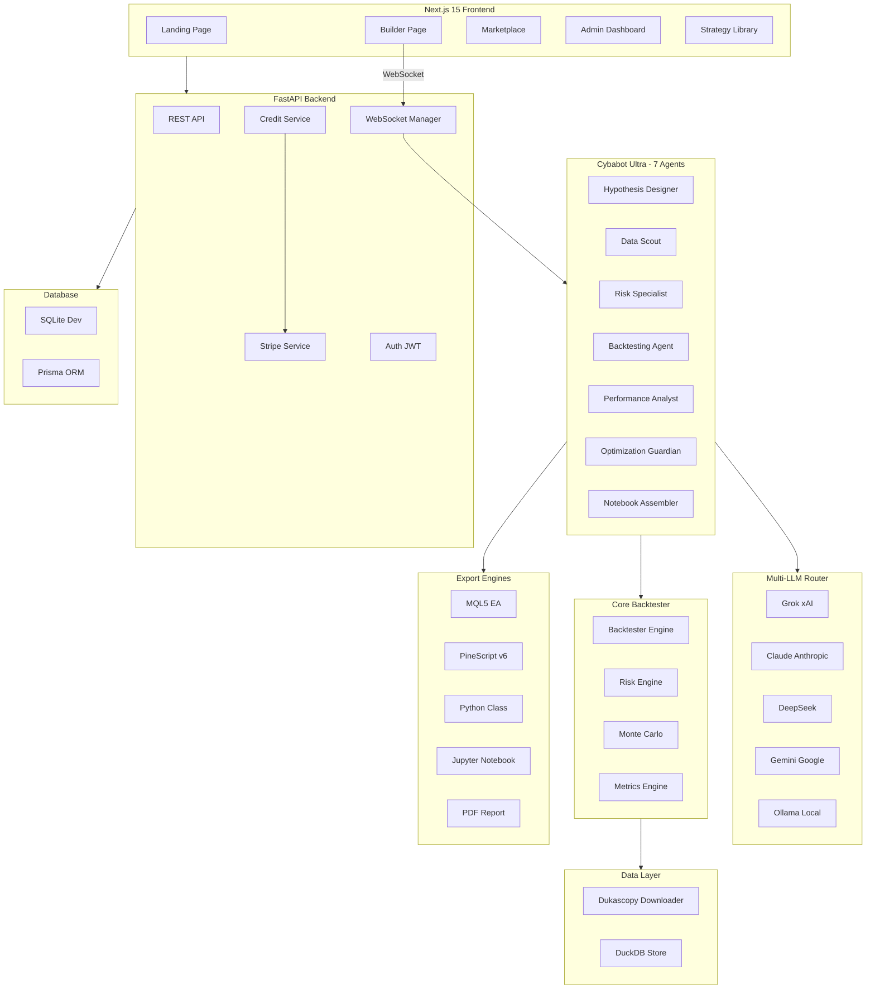
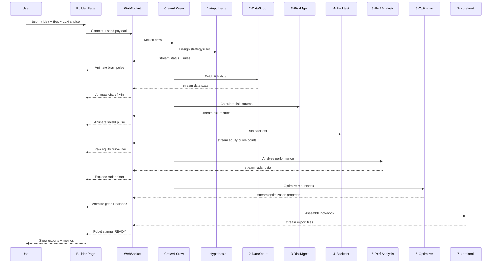
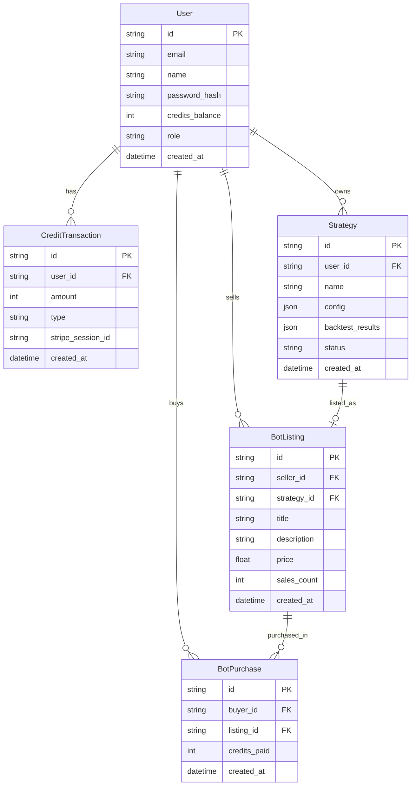

# ForexPrecision RoboQuant — Cybabot Ultra
## Full Architecture Plan

---

## 1. Project Overview

**ForexPrecision RoboQuant** is a production-ready open-source monorepo featuring **Cybabot Ultra** — a 7-agent AI crew that builds complete, backtested, ready-to-deploy forex trading strategies from plain text, images, PDFs, or URLs.

---

## 2. Complete File Tree

```
forex-roboquant/
├── .devcontainer/
│   └── devcontainer.json
├── .github/
│   └── workflows/
│       └── ci.yml
├── frontend/                          # Next.js 15 App Router
│   ├── public/
│   │   ├── hero-video.mp4
│   │   └── icons/
│   ├── src/
│   │   ├── app/
│   │   │   ├── layout.tsx             # Root layout (dark theme, navbar)
│   │   │   ├── page.tsx               # Landing page
│   │   │   ├── globals.css            # Tailwind + cyber theme
│   │   │   ├── builder/
│   │   │   │   └── page.tsx           # Main builder UI
│   │   │   ├── library/
│   │   │   │   └── page.tsx           # Strategy library
│   │   │   ├── marketplace/
│   │   │   │   ├── page.tsx           # Bot marketplace
│   │   │   │   └── [id]/page.tsx      # Bot detail
│   │   │   ├── admin/
│   │   │   │   └── page.tsx           # Admin dashboard
│   │   │   └── api/
│   │   │       ├── auth/[...nextauth]/route.ts
│   │   │       └── stripe/webhook/route.ts
│   │   ├── components/
│   │   │   ├── layout/
│   │   │   │   ├── Navbar.tsx         # Credit balance + nav
│   │   │   │   └── Sidebar.tsx        # Strategy history
│   │   │   ├── landing/
│   │   │   │   ├── HeroSection.tsx
│   │   │   │   ├── FeaturesSection.tsx
│   │   │   │   └── PricingSection.tsx
│   │   │   ├── builder/
│   │   │   │   ├── MultiModalUpload.tsx   # Drag-drop + links
│   │   │   │   ├── LLMSelector.tsx        # Per-agent model picker
│   │   │   │   ├── AgentCrewPanel.tsx     # 7 agent cards container
│   │   │   │   ├── AgentCard.tsx          # Individual animated card
│   │   │   │   ├── EquityCurve.tsx        # Live Chart.js equity
│   │   │   │   ├── RadarChart.tsx         # Performance radar
│   │   │   │   ├── ShieldAnimation.tsx    # Risk shield SVG
│   │   │   │   └── ExportPanel.tsx        # One-click exports
│   │   │   ├── credits/
│   │   │   │   ├── CreditBadge.tsx        # Navbar credit display
│   │   │   │   └── BuyCreditsModal.tsx    # Stripe checkout modal
│   │   │   ├── marketplace/
│   │   │   │   ├── BotCard.tsx
│   │   │   │   ├── BotListingForm.tsx
│   │   │   │   └── MarketplaceFilters.tsx
│   │   │   └── ui/                        # shadcn/ui components
│   │   ├── hooks/
│   │   │   ├── useWebSocket.ts            # WebSocket connection
│   │   │   ├── useCredits.ts              # Credit state
│   │   │   └── useCybabot.ts              # Bot builder state
│   │   ├── lib/
│   │   │   ├── api.ts                     # Axios client
│   │   │   ├── ws.ts                      # WebSocket client
│   │   │   └── stripe.ts                  # Stripe client
│   │   └── types/
│   │       ├── agent.ts
│   │       ├── strategy.ts
│   │       └── marketplace.ts
│   ├── package.json
│   ├── tailwind.config.ts
│   ├── next.config.ts
│   └── tsconfig.json
│
├── backend/                           # FastAPI Python 3.12
│   ├── app/
│   │   ├── main.py                    # FastAPI app + CORS + routers
│   │   ├── config.py                  # Pydantic Settings
│   │   ├── deps.py                    # Dependency injection
│   │   ├── api/
│   │   │   ├── __init__.py
│   │   │   ├── auth.py                # JWT auth endpoints
│   │   │   ├── credits.py             # Credit management
│   │   │   ├── cybabot.py             # Bot builder endpoints
│   │   │   ├── strategies.py          # Strategy CRUD
│   │   │   ├── marketplace.py         # Marketplace endpoints
│   │   │   ├── admin.py               # Admin endpoints
│   │   │   ├── exports.py             # Export endpoints
│   │   │   └── websocket.py           # WS endpoint
│   │   ├── models/
│   │   │   ├── user.py                # SQLAlchemy user model
│   │   │   ├── credit.py              # Credit transaction model
│   │   │   ├── strategy.py            # Strategy model
│   │   │   └── marketplace.py         # Bot listing model
│   │   ├── services/
│   │   │   ├── auth_service.py
│   │   │   ├── credit_service.py      # Credit deduction logic
│   │   │   ├── stripe_service.py      # Stripe integration
│   │   │   └── ws_manager.py          # WebSocket connection manager
│   │   └── middleware/
│   │       └── credit_guard.py        # Credit check middleware
│   ├── pyproject.toml
│   └── Dockerfile
│
├── core/                              # Precision Backtester
│   ├── __init__.py
│   ├── backtester.py                  # Main backtester engine
│   ├── precision.py                   # Decimal precision utils
│   ├── strategy_runner.py             # Strategy execution
│   ├── risk_engine.py                 # Risk/drawdown/margin
│   ├── tick_processor.py              # Tick data processor
│   ├── metrics.py                     # Sharpe, Sortino, Calmar
│   └── monte_carlo.py                 # Monte Carlo simulation
│
├── ai/
│   └── cybabot/
│       ├── __init__.py
│       ├── crew.py                    # CrewAI 7-agent crew
│       ├── agents/
│       │   ├── __init__.py
│       │   ├── hypothesis_designer.py  # Agent 1
│       │   ├── data_scout.py           # Agent 2
│       │   ├── risk_specialist.py      # Agent 3
│       │   ├── backtesting_agent.py    # Agent 4
│       │   ├── performance_analyst.py  # Agent 5
│       │   ├── optimization_guardian.py # Agent 6
│       │   └── notebook_assembler.py   # Agent 7
│       ├── tools/
│       │   ├── __init__.py
│       │   ├── data_tools.py          # Dukascopy fetch tools
│       │   ├── backtest_tools.py      # Backtesting tools
│       │   ├── vision_tools.py        # Image/PDF analysis
│       │   ├── url_tools.py           # URL fetch + summarize
│       │   └── export_tools.py        # Export generation
│       ├── llm_router.py              # Multi-LLM router
│       ├── vision_router.py           # Vision model router
│       └── multimodal_processor.py    # Input processor
│
├── data/
│   ├── __init__.py
│   ├── dukascopy_downloader.py        # Auto tick downloader
│   ├── duckdb_store.py                # DuckDB storage layer
│   ├── tick_schema.py                 # Tick data schema
│   └── raw/                           # Downloaded tick data
│
├── exports/
│   ├── __init__.py
│   ├── mql5_generator.py              # MQL5 EA generator
│   ├── pinescript_generator.py        # PineScript v6 generator
│   ├── python_class_generator.py      # Python class generator
│   ├── jupyter_generator.py           # Jupyter notebook
│   └── pdf_report_generator.py        # PDF report
│
├── prisma/
│   └── schema.prisma                  # Prisma schema
│
├── docker-compose.yml
├── .devcontainer/devcontainer.json
├── .env.example
├── pyproject.toml                     # Root Python config
├── package.json                       # Root Node config
└── README.md
```

---

## 3. System Architecture Diagram



---

## 4. Cybabot Agent Flow



---

## 5. Database Schema



---

## 6. Multi-LLM Router Design

The [`LLMRouter`](ai/cybabot/llm_router.py) supports:

| Provider | Models | Vision |
|----------|--------|--------|
| **Grok (xAI)** | grok-2, grok-vision-beta | Yes |
| **Claude (Anthropic)** | claude-3-5-sonnet, claude-3-opus | Yes (claude-3.5) |
| **DeepSeek** | deepseek-chat, deepseek-coder | No |
| **Gemini (Google)** | gemini-1.5-pro, gemini-1.5-flash | Yes |
| **Ollama** | llama3, mistral, codellama | No |

Per-agent model assignment: each agent receives its own LLM instance from the router.

---

## 7. Credit System Design

### Credit Costs
| Operation | Credits |
|-----------|---------|
| Quick Build (Agents 1-3 only) | 25 |
| Standard Build (All 7 agents) | 75 |
| Full Build + Monte Carlo | 150 |
| Marketplace Listing | 10 |
| Extra export format | 5 |

### Credit Packs (Stripe)
| Pack | Price | Credits |
|------|-------|---------|
| Starter | $5 | 500 |
| Builder | $10 | 2,000 |
| Pro | $25 | 6,000 |
| Enterprise | $50 | 15,000 |

### Free Tier
- 500 credits/month reset
- No Stripe required for free tier usage

---

## 8. Frontend Animation System

### Agent Card States
Each [`AgentCard.tsx`](frontend/src/components/builder/AgentCard.tsx) has 4 states:
- **idle** – dimmed, waiting icon
- **active** – Framer Motion entrance + looping animation
- **success** – green pulse + checkmark
- **error** – red shake animation

### Agent-Specific Animations (Framer Motion)
1. **Hypothesis Designer** – Brain SVG with CSS pulse keyframes
2. **Data Scout** – Magnifier that zooms + bar charts fly in from bottom
3. **Risk Specialist** – Shield with radial gradient aura that pulses
4. **Backtesting Agent** – Speedometer needle rotates + equity curve draws via SVG path animation
5. **Performance Analyst** – Radar chart segments appear sequentially + metric numbers count up
6. **Optimization Guardian** – Gear rotates continuously + balance scale tips
7. **Notebook Assembler** – Code files fly in from sides + robot hand stamp effect

---

## 9. WebSocket Message Protocol

```typescript
// Message from backend -> frontend
type AgentStreamMessage = {
  type: "agent_start" | "agent_progress" | "agent_complete" | "agent_error" | "crew_complete";
  agent_id: 1 | 2 | 3 | 4 | 5 | 6 | 7;
  message: string;
  data?: {
    equity_point?: { x: number; y: number };   // For Agent 4
    radar_data?: Record<string, number>;         // For Agent 5
    metrics?: BacktestMetrics;                   // For Agent 5
    exports?: ExportFiles;                       // For Agent 7
    progress?: number;                           // 0-100
  };
};
```

---

## 10. Marketplace Features

- Users can list finished bots for sale (credits or USD via Stripe)
- Each listing includes: strategy config, backtest results, equity curve screenshot, description, price
- Buyers get a copy of the strategy + export files
- Platform takes 20% commission (configurable in admin)
- Ratings + reviews system
- Categories: Scalping, Swing, Trend-Following, Mean-Reversion, Grid, Arbitrage

---

## 11. Precision Forex Backtester

The [`backtester.py`](core/backtester.py) engine uses:
- `decimal.Decimal` for all price calculations (avoids float drift)
- Tick-level Dukascopy data (bid/ask per tick)
- Realistic spread modeling (variable spread from tick data)
- Overnight swap calculations (long/short rates per instrument)
- Margin/leverage simulation
- Slippage modeling (configurable: fixed, random, volume-based)
- Metrics: Sharpe, Sortino, Calmar, Max Drawdown, Win Rate, Profit Factor, Expectancy

---

## 12. Tech Stack Summary

| Layer | Technology |
|-------|-----------|
| Frontend Framework | Next.js 15 App Router |
| Styling | Tailwind CSS v4 + shadcn/ui |
| Animations | Framer Motion v11 |
| Charts | Chart.js + react-chartjs-2 |
| Icons | Lucide React |
| Backend Framework | FastAPI (Python 3.12) |
| AI Orchestration | CrewAI + LangChain |
| LLM Providers | Grok, Claude, DeepSeek, Gemini, Ollama |
| Database | SQLite (dev) via Prisma |
| ORM | Prisma (Node) + SQLAlchemy (Python) |
| Tick Data Store | DuckDB |
| WebSocket | FastAPI native WS |
| Auth | NextAuth.js + JWT |
| Payments | Stripe (test keys) |
| Containerization | Docker + Docker Compose |
| Linting | Ruff (Python) + ESLint + Prettier |
| Type Checking | mypy + TypeScript strict |

---

## 13. Implementation Order (Critical Path)

### Batch 1 — Foundation
1. Monorepo scaffold + all config files
2. Prisma schema
3. Docker Compose

### Batch 2 — Backend Core
4. FastAPI app skeleton + config + deps
5. SQLAlchemy models + database init
6. Auth endpoints (register/login/JWT)
7. Credit service + Stripe webhook

### Batch 3 — AI Core
8. Multi-LLM router (all 5 providers)
9. Vision router + multimodal processor
10. Cybabot 7 agents + tools
11. CrewAI crew with WebSocket streaming

### Batch 4 — Core Engine
12. Precision backtester
13. Risk engine + Monte Carlo
14. Dukascopy downloader + DuckDB

### Batch 5 — Exports
15. MQL5 EA generator
16. PineScript v6 generator
17. Python class + Jupyter + PDF

### Batch 6 — Frontend
18. Next.js setup + theme + layout
19. Landing page
20. Builder page + all components
21. Marketplace + admin

---

## 14. Environment Variables (.env.example)

```bash
# LLM Providers
XAI_API_KEY=xai-...
ANTHROPIC_API_KEY=sk-ant-...
DEEPSEEK_API_KEY=sk-...
GOOGLE_API_KEY=AIza...
OLLAMA_BASE_URL=http://localhost:11434

# Stripe
STRIPE_SECRET_KEY=sk_test_...
STRIPE_WEBHOOK_SECRET=whsec_...
NEXT_PUBLIC_STRIPE_PUBLISHABLE_KEY=pk_test_...

# Auth
NEXTAUTH_SECRET=your-secret-here
NEXTAUTH_URL=http://localhost:3000
JWT_SECRET=your-jwt-secret

# Database
DATABASE_URL=file:./dev.db

# Backend
BACKEND_URL=http://localhost:8000
NEXT_PUBLIC_BACKEND_WS_URL=ws://localhost:8000

# Admin
ADMIN_EMAIL=admin@example.com
```
